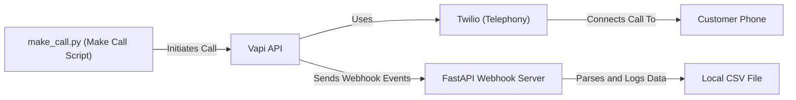

# Voice-Agents: Vapi 🎙️

A powerful AI voice agent system that handles automated calls using VAPI and Twilio integration. This system can make outbound calls, process responses, and save detailed call logs.

## 🌟 Features

- Automated outbound calling using VAPI AI
- International number support through Twilio integration
- Real-time call processing and logging
- Webhook-based event handling
- Detailed call logs with transcripts and recordings
- FastAPI server for handling VAPI events

## 🏗️ Architecture



## 🚀 Getting Started

### Prerequisites

- Python 3.8+
- ngrok for webhook handling
- VAPI account and API key
- Twilio account (for international numbers)

### Installation

```
Setup basic twilio account and get a phone number
Setup vapi account and create an assistant and get an api key
after that import the twilio number to vapi and get a phone number id
```

1. Clone the repository:
```bash 
git clone https://github.com/akashdv25/Voice-Agents.git
cd Voice-Agents
```

2. Create and activate a virtual environment:
```bash
python -m venv myvenv
source myvenv/bin/activate  # On Windows: myvenv\Scripts\activate
```

3. Install dependencies:
```bash
pip install -r requirements.txt
```

4. Create a `.env` file in the root directory with your credentials:
```env
VAPI_TOKEN='your_vapi_token'
VAPI_ASSISTANT_ID='your_assistant_id'
PHONE_NUMBER_ID='your_phone_number_id'
```

## 📞 Usage

1. Start the FastAPI server:
```bash
uvicorn src.main:app --reload
```

2. Start ngrok to expose your local server:
```bash
ngrok http 8000
```

3. Make a call using the provided script:
```bash
python src/make_call.py
```

## 📊 Call Logs

All call data is automatically saved to `calls.csv` in the root directory. The CSV file includes:
- Call ID
- Timestamp
- Call summary
- Transcript
- Recording URL
- Complete chat log

## 🔄 Flow Process

1. Call initiation through VAPI to customer number
2. Twilio handles international number routing
3. `make_call.py` manages the call setup using environment variables
4. FastAPI server processes VAPI webhook events
5. Call logs are saved to CSV file
6. ngrok exposes local server for webhook handling

## 📝 API Endpoints

### POST /webhook
- Handles VAPI webhook events
- Processes end-of-call reports
- Saves call data to CSV
- Returns status confirmation

## 🛠️ Configuration

The system uses the following environment variables:
- `VAPI_TOKEN`: Your VAPI API key
- `VAPI_ASSISTANT_ID`: ID of your VAPI AI assistant
- `PHONE_NUMBER_ID`: Your phone number ID for outbound calls

## 📄 License

This project is licensed under the MIT License - see the [LICENSE](LICENSE) file for details.

## 🤝 Contributing

Contributions are welcome! Please feel free to submit a Pull Request.

## 📮 Support

For support, please open an issue in the GitHub repository or contact the maintainers. 